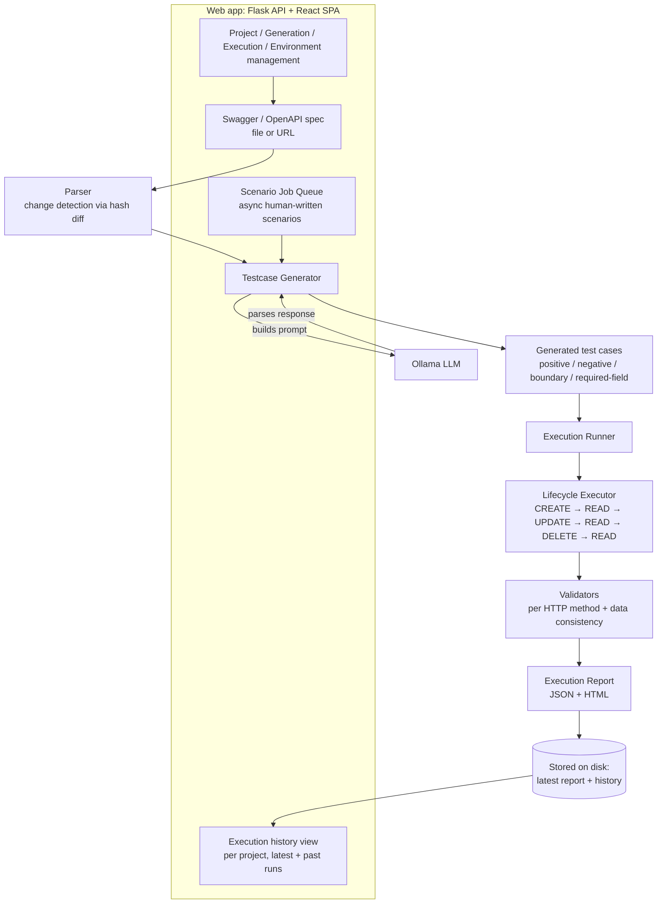

# AI-Powered API Test Automation Framework

An automation framework that takes an OpenAPI/Swagger spec, uses a local LLM (via [Ollama](https://ollama.ai)) to generate positive, negative, boundary, and required-field test cases, orchestrates CRUD-lifecycle execution against the target API, and reports the results through a Flask + React web app for managing projects, generations, executions, and environments.

## Tech Stack

- **Backend:** Python 3, Flask, Flask-CORS, PyJWT, PyYAML, Requests
- **Frontend:** React 18, Vite, MUI, Axios, React Router, Recharts
- **LLM:** Ollama (local), default model `qwen3.5:9b`
- **Storage:** flat JSON files under `framework_data/` (no external database)

## Architecture & Data Flow



Through the web app, users manage projects, upload Swagger specs, trigger generations and executions, define environments, submit human-written scenarios as async background jobs (via the scenario job queue), review/approve generated test cases, and view execution reports — both the latest run and historical runs per project.

Identity & change detection: the parser computes a hash per API endpoint and compares it against the previously parsed spec, so only new or changed endpoints are regenerated. Lifecycle execution stores created resources in a resource context so dependent steps (READ/UPDATE/DELETE) can reuse real resource IDs from prior responses.

## Project Layout

```
app/                  Flask application (routes, controllers, middleware, storage, scenario job queue)
Parser/                Swagger/OpenAPI parsing and change detection
testcase_generator/    LLM-driven test case generation (prompts, parsing, retries, scenario-based generation)
execution/             Test execution engine (HTTP execution, lifecycle orchestration, validators)
storage/               JSON persistence for test cases and execution reports
prompts/               Markdown prompt templates used for LLM calls
llm/                   LLM client abstraction (Ollama connector)
frontend/              React SPA (Vite, MUI)
configs/               settings.py — LLM, paths, users, JWT, logging config
Utils/                 Shared utilities (logging, resource grouping)
server.py              Flask web server entry point
```

## Prerequisites

- Python 3.x and pip
- Node.js and npm (for the frontend)
- [Ollama](https://ollama.ai) installed and running locally, with the configured model pulled:
  ```
  ollama pull qwen3.5:9b
  ```
  Ollama must be reachable at `http://localhost:11434` (configurable in `configs/settings.py`).

## Local Setup

1. **Install backend dependencies**
   ```
   pip install -r requirements.txt
   ```

2. **Start Ollama** and make sure the model from `configs/settings.py` (`qwen3.5:9b` by default) is pulled.

3. **Run the web app**
   ```
   python server.py
   ```
   The Flask API starts on `http://localhost:8080`.

4. **Run the frontend (dev mode)**
   ```
   cd frontend
   npm install
   npm run dev
   ```

5. **Log in** with one of the default accounts from `configs/settings.py` (change these, and the JWT secret, before any production use):
   - `admin` / `admin123` (admin role)
   - `viewer` / `viewer123` (viewer role)
