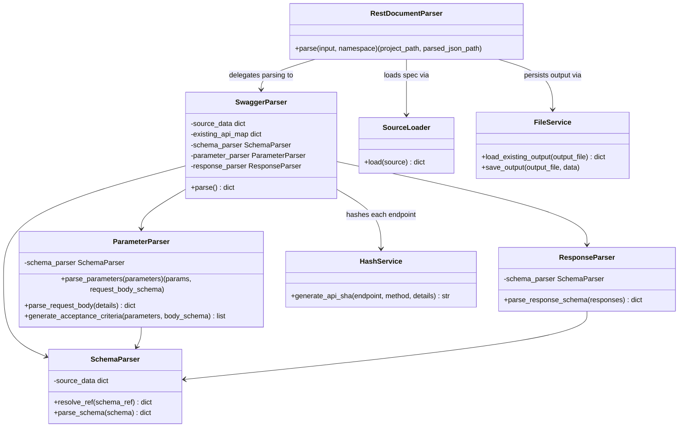
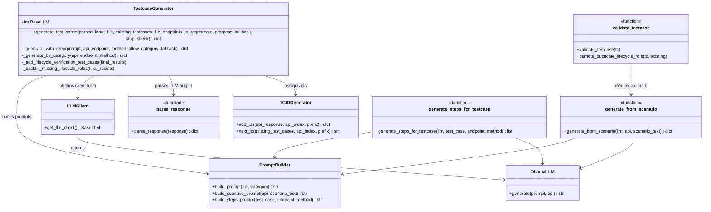
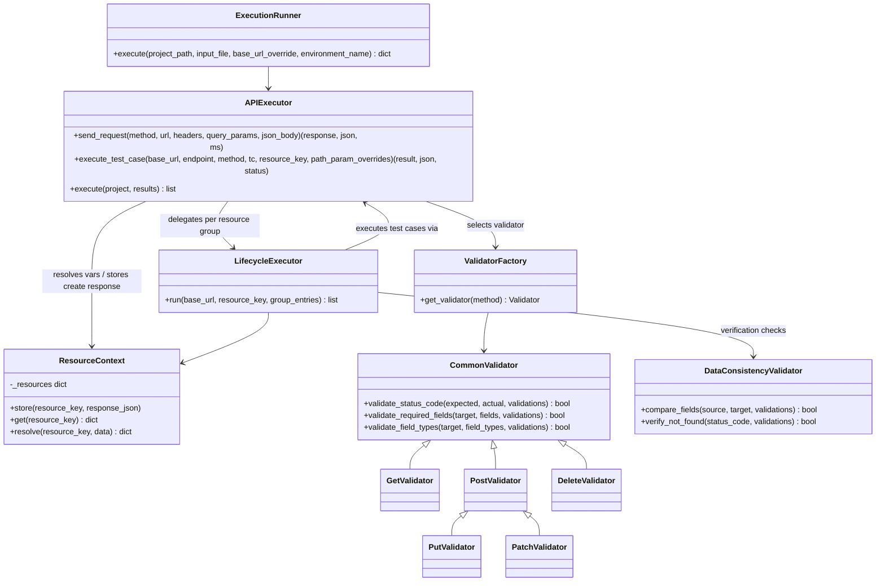
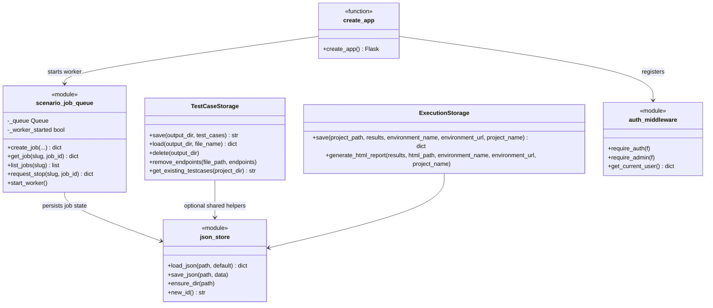
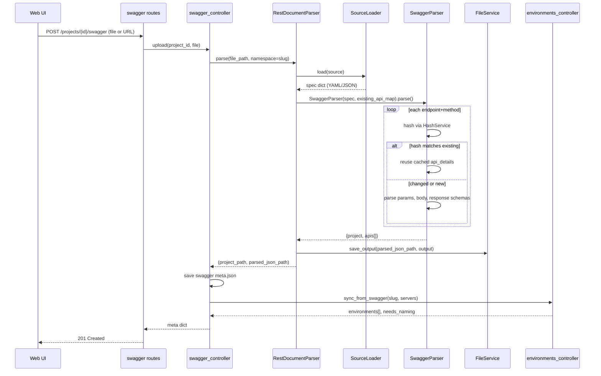
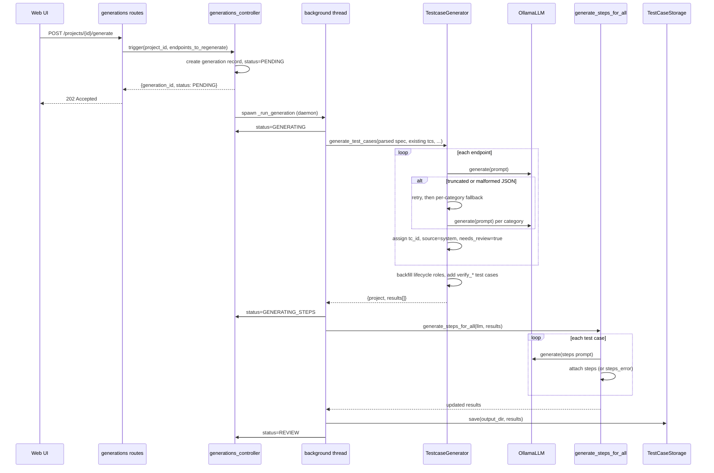
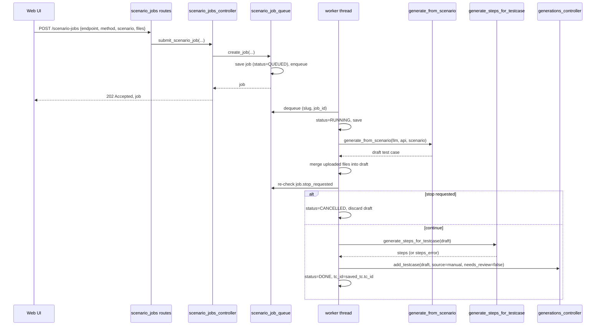
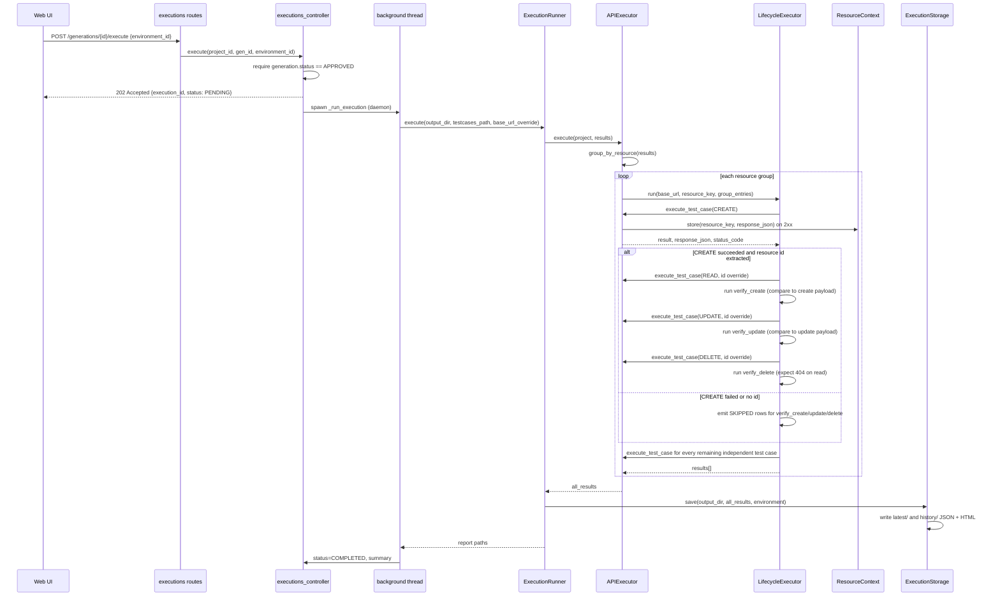
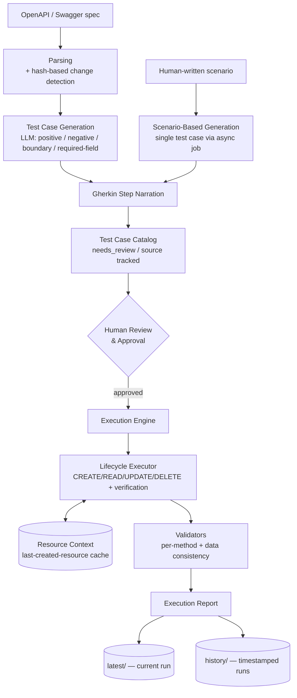

# Technical Reference

This document is the engineering-level reference for this codebase: class diagrams, sequence diagrams, data models, and runtime behavior. For a product-level description of what the app does, see [features.md](features.md); for setup and a quick architecture overview, see the [root README](../README.md).

Each diagram below covers one coherent module or flow and is followed by a short explanation of what it shows and anything non-obvious about it.

## Module Map

| Module | Responsibility | Key files |
|---|---|---|
| `app/` | Flask application: routes, controllers, middleware, async services | `app/routes/`, `app/controllers/`, `app/middleware/`, `app/services/scenario_job_queue.py` |
| `Parser/` | Swagger/OpenAPI parsing and change detection | `Parser/rest_document_parser.py`, `Parser/swagger/`, `Parser/Utils/` |
| `llm/` | LLM client abstraction | `llm/core/llm_client.py`, `llm/connectors/ollama/client.py` |
| `testcase_generator/` | LLM-driven and scenario-based test case generation | `testcase_generator/*.py` |
| `execution/` | Test execution engine: HTTP calls, CRUD lifecycle orchestration, validation | `execution/*.py`, `execution/validators/` |
| `storage/` | Persistence for test case catalogs and execution reports | `storage/testcase_storage.py`, `storage/execution_storage.py` |
| `app/storage/json_store.py` | Generic JSON read/write helpers used by controllers | `app/storage/json_store.py` |
| `frontend/` | React SPA | `frontend/src/` |
| `configs/` | LLM, paths, users, JWT, logging configuration | `configs/settings.py` |

## Class Diagram — Parsing



`RestDocumentParser` is the single entry point: it loads the raw spec with `SourceLoader` (local file or URL), hands it to `SwaggerParser`, and saves the result with `FileService`. `SwaggerParser` does the real work, using `SchemaParser` to resolve `$ref`s and normalize schema shapes, `ParameterParser` for path/query/header/body extraction, and `ResponseParser` for response schemas. Before fully parsing an endpoint, `SwaggerParser` computes its hash via `HashService` and checks it against `existing_api_map` (the previous run's output) — on a match, it reuses the cached `api_details` instead of re-running the parsers, which is what makes re-importing a lightly-changed spec cheap.

## Class Diagram — Generation



`TestcaseGenerator` is the bulk generation entry point used by the main generation flow; `generate_from_scenario` is the lighter, single-test-case path used by the scenario job queue. Both go through the same `PromptBuilder` → `OllamaLLM` → `parse_response` pipeline, just with different prompt templates and (for the bulk path) retry/fallback logic in `_generate_with_retry`/`_generate_by_category`. `validate_testcase` and `demote_duplicate_lifecycle_role` are shared safety nets called wherever a test case is added or edited (bulk generation, scenario generation, and manual creation), not generation-specific logic.

## Class Diagram — Execution



`ExecutionRunner` loads a test case catalog and hands it to `APIExecutor`, which groups test cases by resource and runs each group through `LifecycleExecutor`. Every individual HTTP call — whether part of a lifecycle chain or an independent test case — goes through `APIExecutor.execute_test_case`, which resolves `{LAST_CREATED_RESOURCE.*}` placeholders via `ResourceContext`, sends the request, and dispatches to the right validator class via `ValidatorFactory`. `PostValidator` adds request/response value-matching on top of the common checks, and `PutValidator`/`PatchValidator` inherit that behavior since they have the same echo-back semantics; `DeleteValidator` only checks status code. `DataConsistencyValidator` is used specifically by `LifecycleExecutor` for the synthesized verification steps (comparing a create/update payload against a later read, and confirming a 404 after delete) rather than for ordinary test case validation.

## Class Diagram — Storage & App Layer



`json_store` is the generic JSON-file persistence layer (no schema awareness) that controllers and `scenario_job_queue` use directly; `TestCaseStorage` and `ExecutionStorage` are slightly more specialized — the former owns the `generated_testcases.json` shape, the latter owns writing both the JSON and HTML execution reports to `latest/` and `history/`. `create_app()` wires the Flask app together: registering blueprints, attaching `auth_middleware`'s decorators for route protection, and starting the scenario job queue's background worker once at boot. None of these storage classes implement locking — see [Storage Layer Mechanics](#storage-layer-mechanics) below.

## Sequence Diagram — Swagger Upload



The change-detection branch inside `SwaggerParser.parse()` is the key behavior to notice: on a re-upload, only endpoints whose hash changed go through full re-parsing, everything else is copied forward unchanged. After parsing, the controller immediately syncs environments from the spec's `servers` list so the UI can prompt the user to name them if needed.

## Sequence Diagram — Test Case Generation



Generation runs entirely in a background thread so the HTTP request returns immediately with a `PENDING` status; the UI polls the generation record for progress. The per-category fallback exists specifically because a single combined prompt covering all four categories for one endpoint can exceed the model's output token limit — splitting by category produces smaller, more reliable individual calls. Every test case coming out of this path is marked `source: "system"` and `needs_review: true`, which is what populates the review queue.

## Sequence Diagram — Scenario Job Processing



The important detail is *when* cancellation is honored: a queued job can be cancelled before it starts (the worker just skips it), but a running job's `stop_requested` flag is only checked again right before the result is saved — after the LLM call has already completed — because there's no way to interrupt the in-flight LLM request itself. On server restart, `_reconcile_on_startup` re-queues anything left `QUEUED` and marks anything caught `RUNNING` as `FAILED`, since a thread that was mid-job is gone.

## Sequence Diagram — Execution & CRUD Lifecycle



This is the framework's "self-healing" verification loop made explicit: a successful CREATE seeds `ResourceContext` with the real resource, and every subsequent step in the chain (READ, UPDATE, DELETE, and their `verify_*` counterparts) uses the *actual* resource ID rather than a hardcoded one. If CREATE doesn't succeed, or the response doesn't contain a recognizable ID field, the dependent verification test cases are not silently dropped — they're recorded as explicit `SKIPPED` rows with a reason, which guarantees the result count always matches the test case catalog count. Test cases that aren't part of the lifecycle (negative/boundary/independent cases) execute the same way regardless, just without any resource chaining.

## Data Flow Diagram



This is a more detailed version of the diagram in the root README: it makes explicit that the human review/approval gate sits between generation and execution (nothing reaches the execution engine unapproved), and that the lifecycle executor reads from and writes to the resource context as it runs — that bidirectional arrow is what enables CREATE's response to inform the later READ/UPDATE/DELETE/verification steps in the same run.

## Data Models

These are the persisted shapes used across the system, as JSON (the canonical storage format — there is no database).

```json
// Project
{
  "id": "string",
  "name": "string",
  "slug": "string",
  "description": "string",
  "created_at": "ISO8601",
  "updated_at": "ISO8601"
}

// Generation
{
  "id": "string",
  "project_id": "string",
  "status": "PENDING|GENERATING|SCENARIOS_READY|GENERATING_STEPS|REVIEW|APPROVED|STOPPED|FAILED",
  "created_at": "ISO8601",
  "completed_at": "ISO8601|null",
  "error": "string|null",
  "progress": { "completed": 0, "total": 0, "current": "string" },
  "testcases_path": "string|null",
  "output_dir": "string",
  "stop_requested": false
}

// TestCase
{
  "tc_id": "string",
  "test_scenario": "string",
  "lifecycle_role": "independent|create|read|update|delete|verify_create|verify_update|verify_delete",
  "source": "system|manual",
  "needs_review": true,
  "path_params": {}, "query_params": {}, "headers": {}, "request_data": {}, "files": {},
  "expected_response": {
    "status_code": 200,
    "required_fields": ["string"],
    "field_types": { "field": "string|integer|number|boolean|array|object" }
  },
  "steps": ["string"]
}

// ExecutionResult
{
  "tc_id": "string",
  "test_scenario": "string",
  "lifecycle_role": "string",
  "status": "PASS|FAIL|SKIPPED",
  "skip_reason": "string|null",
  "expected_status_code": 200,
  "actual_status_code": 200,
  "execution_time_ms": 0.0,
  "request": { "method": "string", "url": "string", "query_params": {}, "headers": {}, "request_data": {}, "path_params": {} },
  "response_body": "string",
  "validation_details": [{ "check": "string", "expected": "any", "actual": "any", "passed": true }]
}

// Execution
{
  "id": "string",
  "project_id": "string",
  "generation_id": "string",
  "status": "PENDING|RUNNING|COMPLETED|FAILED",
  "started_at": "ISO8601",
  "completed_at": "ISO8601|null",
  "report_html": "string|null",
  "report_json": "string|null",
  "summary": { "total": 0, "passed": 0, "failed": 0, "skipped": 0, "success_rate": 0.0 },
  "environment_id": "string|null",
  "environment_name": "string|null",
  "base_url": "string|null"
}

// ScenarioJob
{
  "id": "string",
  "project_id": "string", "slug": "string", "gen_id": "string",
  "endpoint": "string", "method": "string", "scenario": "string",
  "files": {},
  "status": "QUEUED|RUNNING|DONE|FAILED|CANCELLED",
  "stop_requested": false,
  "created_at": "ISO8601", "started_at": "ISO8601|null", "completed_at": "ISO8601|null",
  "tc_id": "string|null", "error": "string|null"
}

// Environment
{ "id": "string", "name": "string", "url": "string", "source": "swagger|manual" }

// ResourceContext entry (in-memory only, keyed by resource_key)
{ "id": "any", "...": "rest of the create response JSON" }
```

## Concurrency Model

Generation and execution each run as a single, one-off daemon `threading.Thread` spawned per request — there's no thread pool or queue at that layer; progress is communicated back to the UI purely by writing status/progress into the generation/execution's JSON record on disk, which the frontend polls.

The scenario job queue is different: it's a long-lived single daemon worker thread reading from one global `queue.Queue`, so scenario jobs are processed strictly one at a time, in submission order, for the entire app (not per-project). Job state is persisted to disk on every transition, which is what allows `_reconcile_on_startup` to recover sanely from a server restart — queued jobs go back on the queue, and any job that was caught `RUNNING` (meaning its worker thread is gone) is marked `FAILED` rather than left in a stuck state.

One notable limitation: `ResourceContext._resources` is a plain class-level dict, not protected by any lock. It's safe under the assumption that only one execution runs at a time per project (which the UI enforces in practice), but if two executions were ever triggered concurrently, their resource contexts could overwrite each other.

## Storage Layer Mechanics

Everything is stored as flat JSON files under `framework_data/`, organized by project slug:

```
framework_data/
  data/{slug}/
    swagger/{filename}, swagger/meta.json
    generations/{gen_id}.json
    executions/{exec_id}.json
    scenario_jobs/{job_id}.json
  output/{slug}/
    parsed_api.json
    generated_testcases.json
  execution_results/{projectName}/
    latest/execution_report.{json,html}
    history/execution_report_{timestamp}.{json,html}
```

`json_store.load_json`/`save_json` are intentionally minimal: reads just `json.load` a file (or return a default if it doesn't exist), and writes truncate-and-rewrite the file with `json.dump`. There is no file locking and no atomic write-then-rename — if two writers touch the same file concurrently, the last write wins and a process crash mid-write can leave a corrupted file. In practice this is acceptable because almost every write path is a single background thread per generation/execution/job, but it's a real constraint to keep in mind if this were ever extended to support concurrent operations on the same entity.
